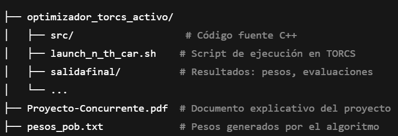

# UEA: Computo Concurrente
# 🚗 Optimizador de Controladores para TORCS

Este proyecto implementa un algoritmo genético distribuido para optimizar los pesos de controladores autónomos en el simulador de conducción **TORCS** (The Open Racing Car Simulator), aprovechando la computación concurrente mediante **MPI** y una arquitectura en **islas con topología en anillo**.

---

## 🎯 Objetivo

Diseñar un sistema de optimización de controladores autónomos para TORCS mediante un algoritmo genético, capaz de buscar mejores soluciones (pesos de la red neuronal) usando múltiples procesos distribuidos y comunicados por **MPI**.

---

## 🧬 Descripción técnica

- Se utiliza un **algoritmo genético** en múltiples procesos (islas).
- Cada proceso evoluciona su propia población de controladores.
- Se implementa una **migración entre islas** para compartir soluciones prometedoras.
- Los controladores son evaluados usando métricas como **tiempo de carrera** y **distancia restante**, calculadas tras simular carreras en TORCS.
- El sistema escribe las mejores soluciones en archivos como `pesos_pob.txt` y `evals_pop.txt`.

---

## 📚 Arquitectura del sistema

- 🧬 **Algoritmo genético** que evoluciona los pesos de redes neuronales por población.
- 🔄 **Migración en anillo (Ring Topology):**
  - Implementada con `MPI_Send` y `MPI_Recv`.
  - Envío de individuos entre islas.
- 🧾 **Unión de poblaciones**: Al final, todas las islas envían sus mejores soluciones a la isla 0, que unifica la población global.

---

## 🛠 Tecnologías utilizadas

| Tecnología        | Uso principal                              |
|------------------|--------------------------------------------|
| `MPI (OpenMPI)`  | Comunicación entre procesos distribuidos   |
| `C++`            | Implementación del algoritmo genético      |
| `TORCS`          | Simulador de automóviles autónomos         |
| `Shell scripts`  | Automatización de simulaciones con TORCS   |

---

## 📂 Archivos clave

- `pesos_pob.txt` → Pesos de la red neuronal por individuo.
- `evals_pop.txt` → Evaluación de desempeño (tiempo/distancia).
- `launch_n_th_car.sh` → Script para ejecutar TORCS con los pesos generados.
- `optimizador_torcs_activo/` → Carpeta principal con el código fuente del proyecto.

---

## 📂 Estructura del repositorio


---

## ▶️ Cómo ejecutar

1. 💻 Compila el proyecto con MPI:  
   ```bash
   mpic++ -o optimizador main.cpp -std=c++11

    ```
2. Ejecuta el optimizador con mpirun:
   ```bash
    mpirun -np 4 ./optimizador
   ```
3. Lanza el mejor controlador en TORCS:
   ```bash
    ./launch_n_th_car.sh ../salidafinal/pesos_pob.txt 16
   ```

---

## 📈 Resultados

Se logró ejecutar exitosamente una población de controladores, evaluar su desempeño y observar convergencia en los pesos más óptimos.

📽 **Video de demostración de TORCS** (carrera con el mejor individuo):  
https://docs.google.com/file/d/1-SNCDIuHAAWOPN4kS8-jzEj_jWtCGFuZ/preview

---

## 📌 Conclusión

Este proyecto combina técnicas de computación paralela con inteligencia artificial evolutiva en un entorno realista, demostrando el uso de arquitecturas distribuidas para resolver problemas complejos de optimización en simuladores.

---

